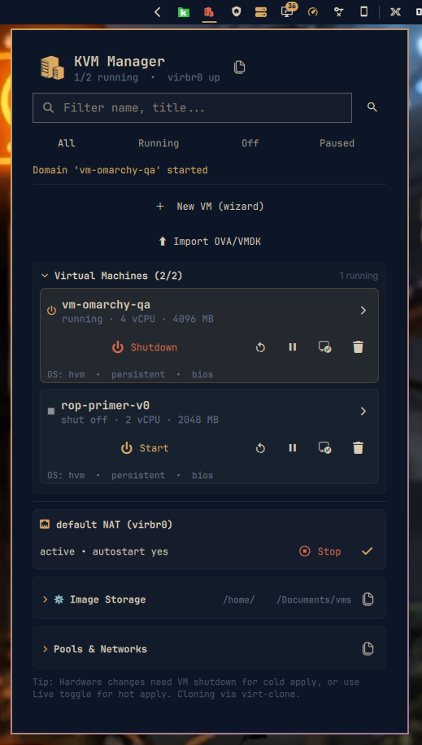

# Omarchy KVM Manager

KVM/QEMU VM manager for the [Omarchy](https://omarchy.org) Quattro bar — `qemu:///system` via `libvirt`/`virsh`.



## Features

- **Live VM list** — `virsh list --all --title` + `dominfo` polling every 3s, badge `running/total` on bar
- **Lifecycle** — Start / Shutdown / Force off (`destroy`) / Reboot / Suspend / Resume / Autostart toggle
- **Console** — `virt-viewer` / `remote-viewer` / `virt-manager --show-domain-console` (SPICE/VNC)
- **Snapshots** — Create / List / Revert / Delete (`virsh snapshot-*`)
- **Network** — Per-VM interface choice: NAT (`network:default`, `virbr0` `192.168.122.0/24`) vs Bridge (`bridge:br0`, LAN IP via host bridge) with `virbr0` status + `Start` / `Stop` / `Autostart` toggle
- **Storage** — Image location settings (`Image Storage`): change default pool path (`/var/lib/libvirt/images` → `/home/user/VMs` or `/mnt/data`, xmodulo method `pool-dumpxml` → `pool-destroy` → `pool-define` → `pool-start` with `755/711` handling for home paths), pool create/list, `virbr0` + `br0` detection
- **Disk relink** — Fix `file not found` after pool move: shows current `vda` path, picker for new `*.qcow2`, `Relink` via `virsh dumpxml` → `define`
- **Hardware** — vCPU / RAM live or cold (`Apply HW` with `Live` toggle), shows `virtio`, `host-passthrough` hints
- **Import OVA/VMDK** — Local import via `ova_to_qcow2.sh` (non-interactive, `set -euo pipefail`, autodetect `.vmdk`/`*.vmdk.gz` vs OVA tar, `mktemp -d` user-owned, `qemu-img convert -p`, `pool-refresh`, `virt-install --import`): file picker (`*.ova *.vmdk *.vmdk.gz`), `KVM local` target, VM Name / RAM / vCPUs / Pool Path / OS Variant, `--no-create` for convert-only, real-time log with `SplitParser` + `Copy`/`Clear`
- **Pools & Networks** — Storage pools (`pool-list --all`, `pool-info`, `vol-list`, create) and virtual networks (`net-list`, `net-info`, `net-dhcp-leases`) — collapsable
- **Wizard** — Create VM from scratch (General → Resources → Storage → Network → Summary) with `virt-install` backend, `osinfo-query` OS variants, `edk2-ovmf` UEFI / `swtpm` TPM, `virtio` disk/net
- **Details** — vCPU, RAM, OS, firmware (BIOS/UEFI), TPM, autostart, snapshots, `domifaddr` IP (lease/arp/agent), `domblkinfo`, stats (`domstats`) compact scrollable (90px, `caption-2`)
- **No secrets** — local-only `virsh`, no passwords stored, no telemetry, `libvirt` group only, validates `^[a-zA-Z0-9._-]+$`

## Installation

```bash
omarchy plugin add https://github.com/tug-benson/omarchy-kvm --enable
```

Or symlink for development:

```bash
ln -s /path/to/omarchy-kvm ~/.config/omarchy/plugins/io.github.tug-benson.omarchy-kvm
omarchy-shell shell rescanPlugins
```

Remove:

```bash
omarchy plugin remove io.github.tug-benson.omarchy-kvm
```

## Dependencies

All **manual** via `pacman` — no auto-install (see `scripts/setup-kvm.sh` for idempotent setup):

```bash
# Base hypervisor (from https://computingforgeeks.com/install-kvm-arch-linux/)
sudo pacman -S --needed qemu-full virt-manager virt-viewer libvirt dnsmasq edk2-ovmf edk2-aarch64 edk2-riscv64 swtpm iptables-nft dmidecode
# For wizard / import / pool management
sudo pacman -S --needed virt-install qemu-img libosinfo zenity
# Optional but recommended
sudo pacman -S --needed bridge-utils libguestfs

# Daemon (choose one: monolithic or modular as of 2026)
# Monolithic (legacy, simple NAT):
sudo systemctl enable --now libvirtd
# Modular (current Arch default, handles nftables + UFW):
sudo systemctl enable --now virtqemud.socket virtnetworkd.socket virtstoraged.socket virtinterfaced.socket virtnodedevd.socket virtsecretd.socket virtproxyd.socket
sudo systemctl enable --now virtqemud.service virtnetworkd.service
# Fix for Arch + UFW + nftables (common NAT failure: virbr0 up but no VM IP)
echo 'firewall_backend = "iptables"' | sudo tee -a /etc/libvirt/network.conf
sudo sed -i 's/DEFAULT_FORWARD_POLICY="DROP"/DEFAULT_FORWARD_POLICY="ACCEPT"/' /etc/default/ufw
sudo sed -i 's/#net\/ipv4\/ip_forward=1/net\/ipv4\/ip_forward=1/' /etc/ufw/sysctl.conf
sudo ufw reload
sudo sysctl -w net.ipv4.ip_forward=1

# User in libvirt group
sudo usermod -aG libvirt $USER  # then logout/login or newgrp libvirt
newgrp libvirt  # for current shell, or logout/login

# Default NAT network (virbr0 192.168.122.1/24, dnsmasq, MASQUERADE)
sudo virsh --connect qemu:///system net-start default
sudo virsh --connect qemu:///system net-autostart default
virsh --connect qemu:///system net-list --all  # active yes
ip addr show virbr0  # 192.168.122.1/24
```

See `INSTALL.md` for full Arch setup (bridge `br0` via `nmcli`/`netplan`, nested virt, troubleshooting `firewall_backend`, `UFW`, `dnsmasq`, `virtqemud` vs `libvirtd`).

- `qemu-full` + `libvirt` + `virsh` — hypervisor
- `virt-manager` / `virt-viewer` (`remote-viewer`) / `virt-install` — console / creation
- `qemu-img` — VMDK → qcow2 conversion for OVA import
- `dnsmasq` + `iptables-nft` + `edk2-ovmf` + `swtpm` + `dmidecode` — NAT/UEFI/TPM
- `libosinfo` (`osinfo-query`) — OS variant list
- `zenity` — file/dir pickers (OVA/VMDK, ISO, pool path)
- `bridge-utils` / `libguestfs` — optional

## Usage

1. Click the KVM icon in the bar → panel opens (search at top).
2. **Search / filter** `All / Running / Off / Paused` + filter field + `Open virt-manager`.
3. **VM row**: state icon + `vCPU/RAM/autostart/snapshots` + details toggle.
   - Row actions: `Start` / `Shutdown` / `Reboot` / `Suspend/Resume` / `Console` / `Force off` (running only).
   - Expanded: `Autostart` toggle, `vCPU`/`RAM` + `Live` + `Apply HW`, **Disk** (current `vda` path + picker + `Relink` — fixes `file not found` after pool move), **Network** (`NAT` vs `Bridge`, `Type`/`Source` dropdowns, `Live` + `Apply Network`), `Clone` + `Undefine` (info: `Undefine` keeps disk, `Undefine + storage` deletes it — `Destroy` is only force-off), snapshots + `Create`, stats, `OS`/`persistent`/`firmware`.
4. **Network** (global, just above `Pools & Networks`): `default NAT (virbr0)` `active/inactive • autostart yes/no` + `Start`/`Stop` + `Autostart` toggle.
5. **Image Storage** (collapsable): `Current: /var/lib/libvirt/images` + `Path` + dir picker + `Pool` name + `Move default pool` (xmodulo `pool-dumpxml` → `pool-destroy` → `pool-define` → `pool-start`, handles `/home` `755/711`) / `Create new pool`, `poolDetailText`.
6. **Pools & Networks** (collapsable): `Pools` (`pool-list`, `pool-info`, `vol-list`, `Create pool`) + `Networks` (`net-list`, `net-info`, `net-dhcp-leases`).
7. **Wizard** (`New VM`, 5 steps): `General` (Name, OS variant), `Resources` (vCPU, RAM, `Firmware` `bios`/`uefi`), `Storage` (Disk GB, Pool, ISO path + picker), `Network` (network `default`), `Summary` (log + `Copy`).
8. **Import OVA/VMDK** (collapsable, after wizard): `File *` + picker (`*.ova *.vmdk *.vmdk.gz`), `Target` `KVM local` (`qemu:///system`, Proxmox excluded), `VM Name`*, `RAM`/`vCPUs`, `Pool Path`*, `OS Variant`, `Only convert` checkbox, `Import` → `ova_to_qcow2.sh` (`--no-create` for convert-only) with real-time log + `Copy`/`Clear`.

## Security

- Runs as user in `libvirt` group, no `sudo` inside plugin (except `pkexec` for `pool`/`network` `pool-dumpxml`/`define` which uses polkit). `virsh` validates VM/pool/snapshot names (`^[a-zA-Z0-9._-]+$`, ≤100 chars).
- No remote `qemu+ssh` in v1, no password storage, `settings.json` (`0600`) only if needed.
- Before publish: `grep -R` for homelab data.

## Development

```bash
omarchy plugin validate ~/.config/omarchy/plugins/io.github.tug-benson.omarchy-kvm
qmllint -I "$OMARCHY_PATH/shell" ~/.config/omarchy/plugins/io.github.tug-benson.omarchy-kvm/*.qml
omarchy-shell shell summon io.github.tug-benson.omarchy-kvm '{}'
```

## License

MIT — see `LICENSE`.
